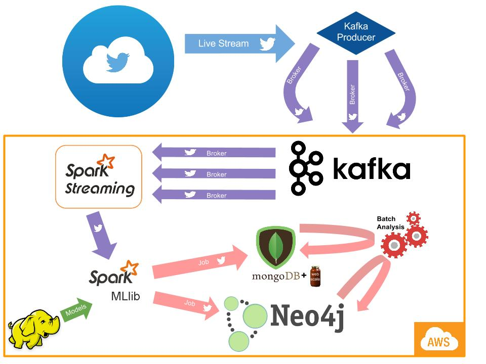

# Architecture

Dataworx is a an architecture for Streaming Analytics with a flexible way to build Machine Learning pipelines as well as provide polyglot persistence. The current version supports NoSQL, HDFS and Graph DBs. Dataworx borrows from the [Lambda Architecture](https://en.wikipedia.org/wiki/Lambda_architecture), but focuses more on the Speed Layer.

The following is an implementation of this architecture (version 1.0) which supports the following:

- HDFS 2.6 (Distributed Storage)
- MongoDB 3.0.5 (NoSQL)
- Neo4j 2.2.4 (GraphDB)
- Apache Spark 1.4.1 (Streaming Analytics)
- Apache Kafka 0.8.1 (Data Bus)

# Deployment and Test environment

At this time Dataworx does not provide a deployment automation solution, but the following projects were leveraged to build and test data flows on AWS and GCE (Google Compute Engine):

- Cloud Foundry BOSH was used as the primary deployment automation tool with releases - [spark-boshrelease](https://github.com/murraju/spark-boshrelease), [kafka-boshrelease](https://github.com/murraju/kafka-boshrelease), [zookeeper-boshrelease](https://github.com/murraju/zookeeper-boshrelease), [mesos-boshrelease](https://github.com/murraju/mesos-boshrelease), and others.

- The Test environment ran a total of 15 instances total to support as basic setup with the ability to scale N+100.

# Implementation Notes

This is an implementation of a generalized streaming architecture that is a standalone Apache Spark app; it manages data flow starting directly from Twitter Streaming API and ends in databases where batch applications can gain further insight from the data. The application leverages AWS, Kafka, Spark Streaming and Spark MLlib as well as MongoDB and Neo4j to get, analyze and store tweets and other data for later processing. While it can be run manually, it is advised to use monit and ``cron`` to automate the jobs as it is possible for failure to happen while streaming.

As one can see from the diagram above, data starts out from Twitter's Streaming API and is collected by our Kafka producer, which in turn sends that data to our Kafka cluster on AWS. In this application, the producer uses Twitter4j Status objects to represent Tweets, and serializes them before sending them to Kafka. There are two reasons Kafka is used as an intermediate step between the Twitter data and Spark Streaming; it is more generalizable and easier to produce to Kafka first and then have Spark read it from Kafka, and Spark Streaming with Twitter data seems to fail on Spark standalone. This is the generalized flow of data, and and the Twitter source can be swapped out with any other streaming source.

Once the data is read into Spark, each microbatch is handed over to Spark MLlib's Naive Bayes classifier. In the model, you can see that the classifier uses a predefined model object stored in HDFS; that is because this app also contains a Python script ``tweetsearch.py`` in the ``scripts`` directory that searches for tweets and stores them in a file format that the ``NaiveBayesTrain.scala`` class can parse and train models with. One important detail that should be mentioned at this point and may be a possible bug in Spark is that users must save the models to file directly from the code. Users might be unable to load the model from HDFS if they used the ``hadoop fs -put`` command; instead, it would load if they saved it directly into HDFS when running the training code.

The machine learning and classification module of this project checks whether the Tweet is a job application offer; the training model made sure to try to differentiate between a Tweet that was looking for new hires rather than someone just talking about their job. If a user wants to use this architecture for something other than classifying jobs, Spark MLlib has implementations of many advanced machine learning algorithms and any user could whip up their own model. Once the selected Tweets are classified, their links are followed by a webscraper and phone and email is extracted, and then all the available information is saved in both a MongoDB collection and a Neo4j database (this functionality is currently commented out as it did not seem to work on the test cluster, although it works locally). The MongoDB collection keeps track of detailed information about Tweets while the Neo4j contains nodes of Tweets, users and tags and have the relationships ``USER -> TWEET`` and ``TWEET -> TAG``. This makes it easy, fast and scalable to recommend jobs to people based on their interests and related interests.

This project also has a batch analysis tool to analyze data saved in the dbs. A user can make any type of batch Spark app that they want, the one included in this project looks through every user and check if they are a bot or not. It does this by using the Twitter API search function to look at the user's timeline and check their Tweeting pattern. If it is suspicious (too fast or too regular), then the user is labeled a bot.

This project was built and run on both local machines and distributed Spark nodes on the AWS cloud. There are scripts included in the application to run both local mode and standalone mode using ``spark-submit``, a useful tool for submitting jobs to Spark. Users who want to run this project out of the box will have to install each of the individual components. To install Spark, simply go to [Spark Installation](http://spark.apache.org/downloads.html). To install Kakfa, go to [Kafka Installation](http://kafka.apache.org/downloads.html) and for an amazing introduction to setting up a local multibroker Kafka instance which this project uses in local mode, go [here](http://www.michael-noll.com/blog/2013/03/13/running-a-multi-broker-apache-kafka-cluster-on-a-single-node/). Users can search how to install MongoDB and Neo4j on their respective machines and operating systems, and HDFS is not needed for local mode. It is highly recommended to use the resources provided by Databricks [here](https://databricks.com/spark/developer-resources) to learn to use Spark.

# Environment variables

Many programs and scripts require users to fill in unique information such as Twitter API keys. If any sort syntax error occurs, make sure that they are filled out. Also, database information must be set in environmental variables! They are ``MONGO_IP``, ``MONGO_PORT``, ``NEO_IP``, ``NEO_PORT``, ``NEO_DB``, ``NEO_USER`` and ``NEO_PASSWORD``.

Take note when using the ``run*.sh`` scripts provided with the project. They are specific towards the setup of the environment, and care should be taken that the values passed in as arguments are correct. Also, if using the python script to collect Tweets, be aware that the 0/1 values must be set manually in the code before each search to what the user wants it to be for the Tweets that will be searched. If there are any questions about the project or setup, feel free to contact me.

# Credits

- Created by [Martin Zhu](http://martinjzhu.com)
- Guidance provided by the Office of the CTO, [Velankani Information Systems, Inc.](http://velankani.net) and [Murali Raju](http://about.me/muraliraju), CTO, Velankani Information Systems, Inc.

# License 

The project is licensed under the current Apache 2.0 license agreement.
