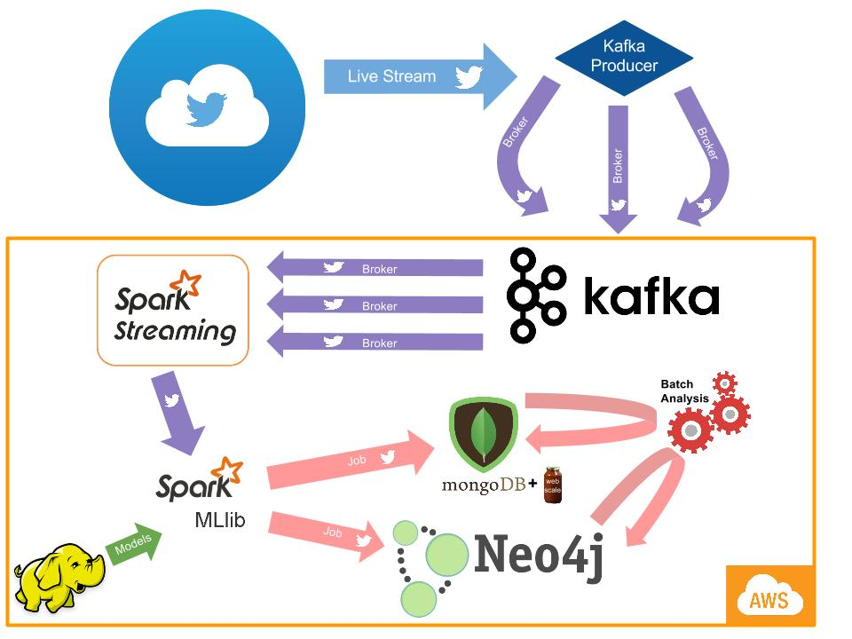

# How it Started

The process of looking for a job today has paradoxically been made much easier and much harder at the same time. While there are countless job aggregation sites such as monster.com where anyone can go and quickly apply to jobs, the availability of these jobs is deceiving. Many aggregation sites fail to remove old postings or keep up to date with the current availability, so the process of weeding out these extraneous jobs is often frustrating. Potential employees can waste many hours writing cover letters and filling out fields for jobs that may not exist. At this project's inception, the idea was to simply create a Spark pipeline that took in live streamed Tweets and use ML to extract job Tweets and put them in a document store database and graph database. Then, a job recommendation system placed on top of the graph database would offer the most up to date job postings to job seekers. Besides this main goal, I also wanted see if I could follow the links in the Tweets to get information about the job poster, such as email, phone numbers, validity, ect.

As I implemented the idea, I ran into a few unexpected bumps. The first bump was when a friend told me about [Gozaik](http://www.gozaik.com/). It seemed like someone had already realized the potential of getting live streamed data from Twitter, and it is no surprise they were acquired by Monster. However, the details of their implementation is almost nonexistent, and I wanted to see if I could take a different approach and do more, as well as take the opportunity to learn about new technologies. This is exploratory data science after all, and any intermediate results could alter the course of the project.

As the project started coming together and I was able to collect a good number of Tweets, I started noticing a disturbing pattern. It seemed like many of the entities posting job Tweets were not the actual employers, but from job aggregator, exactly the thing I was trying to avoid in the first place! Because of this, and the fact that I was able to collect a few hundred Tweets in less than an hour, I became suspicious that the apparently job availability based on Twitter was in fact an illusion. There definitely is not a consistent growth of a few hundred jobs every hour in the U.S. At this point, I realized would have to create a system that identifies both Tweets from job aggregation sites as well as one that identifies Tweets by bots.

After implementing a source checker and a bot analyzer, the project had already exceeded the initial goal, and was evolving into something more powerful. Arguably the most important aspect of this project is not that it is a product specifically geared for job seekers, but a generalizable architecture in which extracting job information is simply a implementation. The data flow and the use of analytical tools is the core of the project. Because of the modular design, it is very straightforward to swap out the job Tweet classification model for any other model (movies, games, fashion, ect.), get streamed data from sources other than Twitter, and analyze the results with custom algorithms.

I am very grateful for the support that Murali Raju has offered me throughout this project, and it would not have been possible to create without his guidance and resources.

